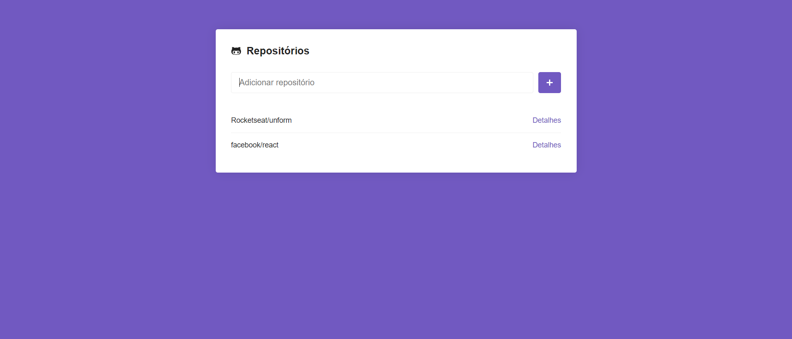
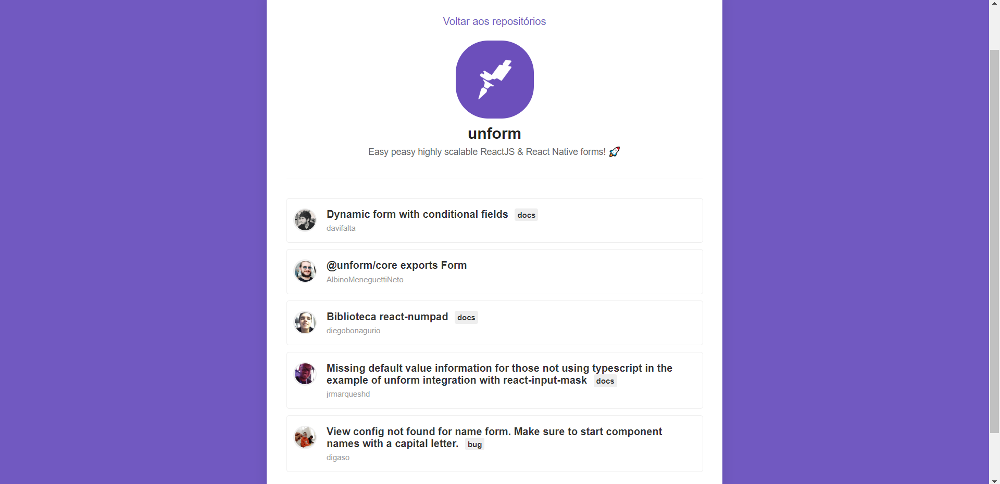

<h2 align="center"> Repositórios no GitHub </h2>

---

Projeto utilizado para consumir a API do GitHub, buscando e listando repositórios e issues.

<h1 align="center">
    
</h1>
<h1 align="center">
    
</h1>

Dúvidas entre em contato pelo <h4 align="center">  <a href="https://www.linkedin.com/in/marco-antonio-monteiro-de-brito-541ba0144/" target="_blank">Linkedin</a> </h4>

<h4 align="center"> <em>&lt;/&gt;</em> by <a href="https://github.com/marcomonteirobrito" target="_blank">marcomonteirobrito</a> </h4>
